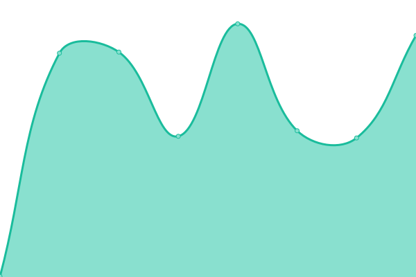
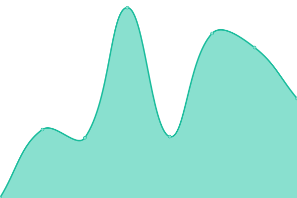
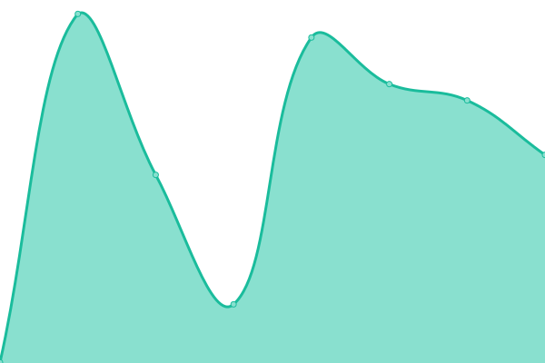
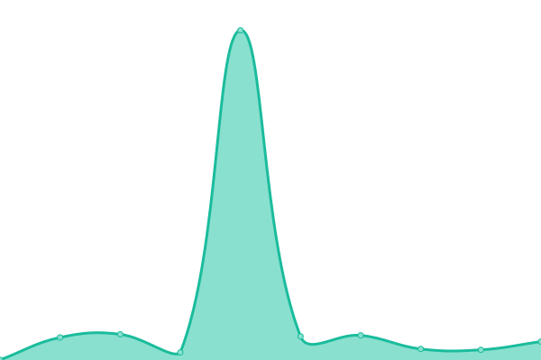

# [📈 Live Status](https://hcpss.github.io/status): <!--live status--> **🟩 All systems operational**

This repository contains the open-source uptime monitor and status page for [Howard County Public School System](http://www.hcpss.org), powered by [Upptime](https://github.com/upptime/upptime).

With [Upptime](https://upptime.js.org), you can get your own unlimited and free uptime monitor and status page, powered entirely by a GitHub repository. We use [Issues](https://github.com/hcpss/status/issues) as incident reports, [Actions](https://github.com/hcpss/status/actions) as uptime monitors, and [Pages](https://hcpss.github.io/status) for the status page.

<!--start: status pages-->
<!-- This summary is generated by Upptime (https://github.com/upptime/upptime) -->
<!-- Do not edit this manually, your changes will be overwritten -->
<!-- prettier-ignore -->
| URL | Status | History | Response Time | Uptime |
| --- | ------ | ------- | ------------- | ------ |
|  [Canvas](https://hcpss.instructure.com/courses/34447) | 🟩 Up | [canvas.yml](https://github.com/HCPSS/status/commits/HEAD/history/canvas.yml) | 

 599ms
     
 | 

<a href="https://hcpss.github.io/status/history/canvas">100.00%</a>
    

|  [Microsoft](https://www.office.com/) | 🟩 Up | [microsoft.yml](https://github.com/HCPSS/status/commits/HEAD/history/microsoft.yml) | 

 176ms
     
 | 

<a href="https://hcpss.github.io/status/history/microsoft">100.00%</a>
    

|  [Google](https://drive.google.com/) | 🟩 Up | [google.yml](https://github.com/HCPSS/status/commits/HEAD/history/google.yml) | 

 277ms
     
 | 

<a href="https://hcpss.github.io/status/history/google">100.00%</a>
    

|  [Clever](https://clever.com/in/hcpss/?skip=1&specify_auth=saml) | 🟩 Up | [clever.yml](https://github.com/HCPSS/status/commits/HEAD/history/clever.yml) | 

 440ms
     
 | 

<a href="https://hcpss.github.io/status/history/clever">100.00%</a>
    

|  [Workday](https://www.myworkday.com/wday/authgwy/hcpss/login.htmld) | 🟩 Up | [workday.yml](https://github.com/HCPSS/status/commits/HEAD/history/workday.yml) | 

 487ms
     
 | 

<a href="https://hcpss.github.io/status/history/workday">100.00%</a>
    

|  [Synergy (Staff)](https://critical-status.hcpss.org/edupoint-staff) | 🟩 Up | [synergy-staff.yml](https://github.com/HCPSS/status/commits/HEAD/history/synergy-staff.yml) | 

 319ms
     
 | 

<a href="https://hcpss.github.io/status/history/synergy-staff">100.00%</a>
    

|  [Synergy (Students/Parents)](https://critical-status.hcpss.org/edupoint-parents) | 🟩 Up | [synergy-students-parents.yml](https://github.com/HCPSS/status/commits/HEAD/history/synergy-students-parents.yml) | 

 86ms
     
 | 

<a href="https://hcpss.github.io/status/history/synergy-students-parents">100.00%</a>
    

|  [Duo](https://api-a01cc0d2.duosecurity.com/) | 🟩 Up | [duo.yml](https://github.com/HCPSS/status/commits/HEAD/history/duo.yml) | 

 449ms
     
 | 

<a href="https://hcpss.github.io/status/history/duo">100.00%</a>
    

|  [S/SAM](https://sam.hcpss.org/api/docs/) | 🟩 Up | [s-sam.yml](https://github.com/HCPSS/status/commits/HEAD/history/s-sam.yml) | 

 270ms
     
 | 

<a href="https://hcpss.github.io/status/history/s-sam">100.00%</a>
    

|  [Account Self-Service](https://account.hcpss.org/api/docs/) | 🟩 Up | [account-self-service.yml](https://github.com/HCPSS/status/commits/HEAD/history/account-self-service.yml) | 

 206ms
     
 | 

<a href="https://hcpss.github.io/status/history/account-self-service">100.00%</a>
    

|  [SSO](https://hcpss.me/saml/saml2/idp/metadata.php) | 🟩 Up | [sso.yml](https://github.com/HCPSS/status/commits/HEAD/history/sso.yml) | 

 240ms
     
 | 

<a href="https://hcpss.github.io/status/history/sso">100.00%</a>
    

|  [Active Directory (HCPSS)](https://critical-status.hcpss.org/hcpss) | 🟩 Up | [active-directory-hcpss.yml](https://github.com/HCPSS/status/commits/HEAD/history/active-directory-hcpss.yml) | 

 176ms
     
 | 

<a href="https://hcpss.github.io/status/history/active-directory-hcpss">100.00%</a>
    

|  [Active Directory (INST)](https://critical-status.hcpss.org/inst) | 🟩 Up | [active-directory-inst.yml](https://github.com/HCPSS/status/commits/HEAD/history/active-directory-inst.yml) | 

 85ms
     
 | 

<a href="https://hcpss.github.io/status/history/active-directory-inst">99.93%</a>
    

|  [ADFS](https://critical-status.hcpss.org/adfs/portal/css/style.css) | 🟩 Up | [adfs.yml](https://github.com/HCPSS/status/commits/HEAD/history/adfs.yml) | 

 69ms
     
 | 

<a href="https://hcpss.github.io/status/history/adfs">99.76%</a>
    

<!--end: status pages-->

[**Visit our status website →**](https://hcpss.github.io/status)

## 📄 License

- Powered by: [Upptime](https://github.com/upptime/upptime)
- Code: [MIT](./LICENSE) © [Howard County Public School System](http://www.hcpss.org)
- Data in the `./history` directory: [Open Database License](https://opendatacommons.org/licenses/odbl/1-0/)
